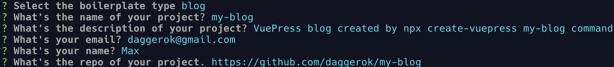

# my-blog [](https://travis-ci.org/daggerok/my-blog)
How to create super easy and blazing fast VuePress blog by using only `npx create-vuepress my-blog` command!

## generate blog boilerplate

```bash
npx create-vuepress my-blog
```



## start development

```bash
npm run dev
```

open http://127.0.0.1:8080/

## build

```bash
npm run build
npm run serve
```

open http://127.0.0.1:5000/

## GitHub Pages

```bash
npm run gh
```

## pm2

```bash
npm start
npm run logs &
npm stop
```

For more details, please head VuePress's [documentation](https://v1.vuepress.vuejs.org/).
